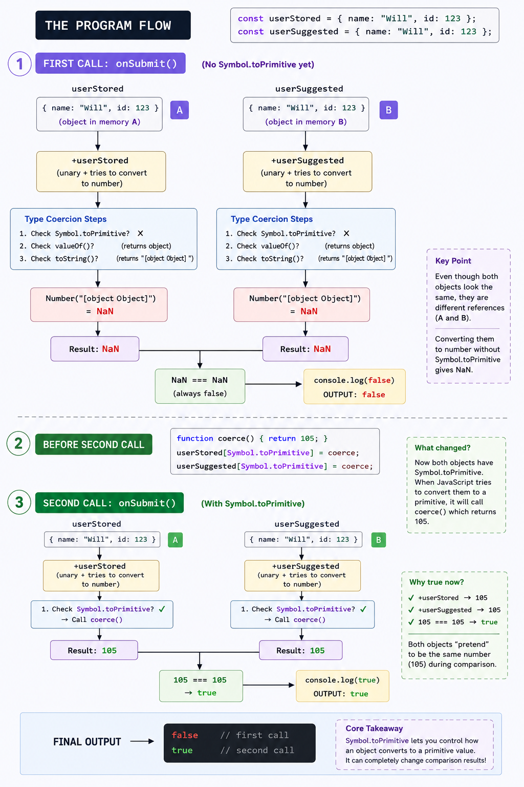

# Type Coercion & Metaprogramming in JavaScript

> Series: Node.js Core & Internals
> Related: Stack & Heap Memory · Closures · Hoisting · TDZ · Operators

## TL;DR

**Type coercion** is JS automatically converting a value from one type to another when an operator or context demands it. **Metaprogramming** is hooking into the language's own internal operations — interception of how the engine reads, writes, converts, or iterates your objects. The two meet at `Symbol.toPrimitive`: a metaprogramming hook that gives you complete control over what your object becomes when the engine coerces it. The program below is the anchor for everything in this doc.

---

## The Reference Program

```javascript
const userStored = { name: "Will", id: 123 };
const userSuggested = { name: "Will", id: 123 };

function onSubmit() {
  if (+userStored === +userSuggested) {
    console.log(true);
  } else {
    console.log(false);
  }
}

function coerce() {
  return 105;
}

onSubmit(); // Phase 1 — no Symbol.toPrimitive

userStored[Symbol.toPrimitive] = coerce;
userSuggested[Symbol.toPrimitive] = coerce;

onSubmit(); // Phase 2 — Symbol.toPrimitive attached
```

**Output:**

```text
false
true
```

Two `onSubmit()` calls, identical objects, completely different results — the only thing that changed is a metaprogramming hook being attached between the two calls. Everything below explains exactly why.



---

## 1. Type Coercion — The Foundation

### What it is

JS is weakly typed: operators do not require matching types. Instead, the engine **implicitly converts** operands using a set of internal abstract operations defined in the ECMAScript spec. These are not JS functions you can call — they are spec-level algorithms the engine runs internally:

| Abstract Operation         | What it does                                                         |
| -------------------------- | -------------------------------------------------------------------- |
| `ToPrimitive(input, hint)` | Converts an object to a primitive (`number`, `string`, or `default`) |
| `ToNumber(value)`          | Converts any value to a number                                       |
| `ToString(value)`          | Converts any value to a string                                       |
| `ToBoolean(value)`         | Converts any value to `true` or `false`                              |

Every coercion you encounter in JS — implicit or explicit — is one or more of these running under the hood.

### Explicit vs Implicit

```javascript
// Explicit — you call the conversion yourself
Number("42"); // 42
String(123); // "123"
Boolean(0) + // false
  // Implicit — the engine calls it for you
  "42"; // 42    → ToNumber triggered by unary +
"" + 123; // "123" → ToString triggered by binary + with a string operand
if (0) {
} // 0 is falsy → ToBoolean triggered by if condition
```

Explicit coercion is always visible in code. Implicit coercion is where bugs come from — operators triggering conversions you didn't notice.

---

## 2. `ToPrimitive` — The Core Algorithm

This is the spec operation at the center of the reference program. It runs whenever an object needs to become a primitive.

### Signature

```javascript
ToPrimitive(input, hint);
hint = "number" | "string" | "default";
```

### What triggers each hint

| Hint        | Triggered by                                                        |
| ----------- | ------------------------------------------------------------------- |
| `"number"`  | Unary `+`, arithmetic operators (`- * /`), comparison (`< > <= >=`) |
| `"string"`  | Template literals `` `${obj}` ``, `String(obj)`                     |
| `"default"` | Binary `+` with mixed types, `==`, no explicit context              |

### The lookup chain (when no `Symbol.toPrimitive` exists)

```text
ToPrimitive(obj, hint)
│
├─ Does obj have Symbol.toPrimitive?
│   └─ YES → call obj[Symbol.toPrimitive](hint), return result
│
└─ NO → OrdinaryToPrimitive(obj, hint)
    │
    ├─ hint === "string" → try toString() first, then valueOf()
    └─ hint === "number" or "default" → try valueOf() first, then toString()
        │
        ├─ valueOf() → plain {} returns the object itself (not a primitive, skip)
        └─ toString() → plain {} returns "[object Object]"  ← this is the fallback
```

For a plain object like `userStored` with no custom hooks, `ToPrimitive` always ends up at `"[object Object]"`.

---

## 3. Phase 1 — What Actually Happens Before The Hook

```javascript
onSubmit(); // first call
```

Inside `onSubmit`:

```javascript
+userStored; // unary + → ToPrimitive(userStored, "number")
```

Step by step:

```text
1. Does userStored have Symbol.toPrimitive?   → NO
2. OrdinaryToPrimitive(userStored, "number")
3. Try valueOf()                               → returns userStored itself (object, skip)
4. Try toString()                              → returns "[object Object]"
5. ToNumber("[object Object]")                → NaN
```

Same path for `+userSuggested` → also `NaN`.

The comparison becomes:

```javascript
NaN === NaN; // false
```

### Why NaN !== NaN

This is not a JS design decision. It is an **IEEE 754** rule, the floating-point standard that every major language (JS, Python, Go, Rust, C, Java) implements. The reasoning: `NaN` represents an undefined/invalid numeric result. There are infinitely many ways to produce `NaN` (`0/0`, `Math.sqrt(-1)`, `Number("abc")`...). Saying two undefined results are equal to each other would be mathematically unsound — they could represent completely different failure modes. So the spec mandates: `NaN` is never equal to anything, including itself.

```javascript
NaN === NaN; // false — IEEE 754, always
Number.isNaN(NaN); // true  — correct way to check
Object.is(NaN, NaN); // true  — identity check, not equality
```

Consequence here: even though both objects go through the exact same coercion and both produce `NaN`, the comparison is still `false`. Two identical failures are not equal.

**Output of first call:** `false`

---

## 4. Phase 2 — Attaching the Metaprogramming Hook

```javascript
userStored[Symbol.toPrimitive] = coerce;
userSuggested[Symbol.toPrimitive] = coerce;
```

This is metaprogramming. You are not adding a regular property — you are plugging into a **well-known symbol** that the JS engine checks internally every time it runs `ToPrimitive`. The engine itself reads `Symbol.toPrimitive` as part of its own abstract operation. You just placed your function directly in that path.

```javascript
function coerce() {
  return 105;
}
```

Now when `onSubmit()` runs:

```javascript
+userStored +
  // ToPrimitive(userStored, "number")
  // → Does userStored have Symbol.toPrimitive? YES
  // → Calls coerce() → returns 105
  // → 105 is a primitive, done

  userSuggested;
// same path → 105
```

Comparison:

```javascript
105 === 105; // true
```

**Output of second call:** `true`

---

## 5. What Metaprogramming Actually Means

Metaprogramming means **writing code that changes how the language itself behaves on your data**. Not the logic of your program — the engine's own operations.

In this program, you didn't change `onSubmit`. You didn't change the `+` operator. You didn't change the comparison. You attached a hook to an engine-level lookup, and the engine's behavior changed as a direct result.

JS exposes several of these hooks. They are all accessed via **well-known symbols** — `Symbol.*` properties that the engine reads as part of its own internal algorithms:

| Symbol                 | Engine operation intercepted                                                   |
| ---------------------- | ------------------------------------------------------------------------------ |
| `Symbol.toPrimitive`   | `ToPrimitive` — controls coercion to primitive                                 |
| `Symbol.iterator`      | Makes object work with `for...of`, spread, destructuring                       |
| `Symbol.hasInstance`   | Controls `instanceof` behavior                                                 |
| `Symbol.toStringTag`   | Controls output of `Object.prototype.toString.call(obj)`                       |
| `Symbol.species`       | Controls what constructor derived objects use (e.g. in `.map()` on a subclass) |
| `Symbol.asyncIterator` | Makes object work with `for await...of`                                        |

These are not monkey-patching. They are **officially designed interception points** — the spec explicitly says "check for this symbol before doing the default thing." You're using the system as intended.

---

## 6. `Symbol.toPrimitive` — Full Control

With the hook in place you receive the `hint` the engine passes — you can branch on it:

```javascript
const user = {
  name: "Will",
  id: 123,
  [Symbol.toPrimitive](hint) {
    if (hint === "number") return this.id; // +user → 123
    if (hint === "string") return this.name; // `${user}` → "Will"
    return this.id; // default → 123
  },
};

console.log(+user); // 123
console.log(`${user}`); // "Will"
console.log(user + ""); // "123" (default hint → number → ToString)
console.log(user + 1); // 124
```

Without this hook, all three would produce `NaN` or `"[object Object]"`. With it, your object participates meaningfully in any operator context.

---

## 7. `valueOf` and `toString` — The Fallback Chain

If you don't define `Symbol.toPrimitive`, you can still partially control coercion by overriding `valueOf` and/or `toString`:

```javascript
const product = {
  price: 49.99,
  label: "Keyboard",
  valueOf() {
    return this.price;
  },
  toString() {
    return this.label;
  },
};

console.log(+product); // 49.99 — hint:number → valueOf()
console.log(`${product}`); // "Keyboard" — hint:string → toString()
console.log(product * 2); // 99.98
console.log(product + "!"); // "49.99!" (default hint → valueOf → ToNumber → ToString... actually varies)
```

`Symbol.toPrimitive` is strictly more powerful because you receive the `hint` directly and make one explicit decision. `valueOf`/`toString` are checked based on hint order and you don't know which one the engine picked. If you want predictable coercion across all operator contexts, `Symbol.toPrimitive` is the right hook.

---

## 8. `Proxy` — Intercepting at the Object Operation Level

`Symbol.toPrimitive` intercepts type conversion specifically. `Proxy` goes deeper — it intercepts fundamental object operations: property reads, property writes, `in` checks, `delete`, function calls, `new`, iteration.

```javascript
const handler = {
  get(target, prop, receiver) {
    console.log(`GET: ${String(prop)}`);
    return Reflect.get(target, prop, receiver);
  },
  set(target, prop, value, receiver) {
    console.log(`SET: ${String(prop)} = ${value}`);
    return Reflect.set(target, prop, value, receiver);
  },
};

const user = new Proxy({ name: "Will" }, handler);
user.name; // logs: GET: name
user.age = 30; // logs: SET: age = 30
```

`Reflect` mirrors every trap with the default engine behavior — it's the "do what JS would have done anyway" escape hatch inside each trap, so you can intercept without having to re-implement the whole operation yourself.

### Where this shows up in real systems

- **Vue 3 reactivity**: wraps component state in a `Proxy` — `get` traps track which computed values depend on which reactive properties, `set` traps trigger re-renders
- **ORMs** (e.g. Mikro-ORM, TypeORM): intercept property writes to track dirty state for change-detection before flushing to the DB
- **Validation layers**: intercept `set` to enforce schema constraints at assignment time rather than at save time
- **Mock/spy libraries** (Jest): intercept function calls to record invocations

---

## 9. `Object.defineProperty` — Descriptor-Level Control

One layer below `Proxy`, before ES6 made `Proxy` available — and still the underlying mechanism for things like class field definitions:

```javascript
const state = {};

Object.defineProperty(state, "count", {
  value: 0,
  writable: true,
  enumerable: true,
  configurable: false, // property cannot be deleted or redefined
});

// Accessor descriptor — getter/setter instead of value
Object.defineProperty(state, "doubled", {
  get() {
    return state.count * 2;
  },
  enumerable: true,
  configurable: true,
});
```

Every property in JS has these hidden attributes — `Object.defineProperty` makes them explicit. This was **Vue 2's reactivity model**: wrapping every data key in a getter/setter via `defineProperty`. Vue 3 replaced this with `Proxy` specifically because `defineProperty` can only intercept known keys defined upfront — it cannot detect new property additions or array index mutations, both of which `Proxy` handles naturally via its `set` trap.

---

## 10. `ToBoolean` — The Falsy Table

Governs every condition: `if`, `while`, `? :`, `&&`, `||`, `!`.

Only eight values are falsy — everything else (including `[]`, `{}`, `"0"`, `"false"`, `new Boolean(false)`) is truthy:

```javascript
false     // false
0         // false
-0        // false
0n        // false (BigInt zero)
""        // false (empty string)
null      // false
undefined // false
NaN       // false

// Everything else:
[]        // true  ← common gotcha
{}        // true  ← common gotcha
"0"       // true
"false"   // true
```

This interacts with `||` and `&&` in a non-obvious way — they don't return `true`/`false`, they return one of their **operands**:

```javascript
"Will" || "default"; // "Will"   — left is truthy, short-circuits
"" || "default"; // "default" — left is falsy, evaluates right
"Will" && "extra"; // "extra"   — left is truthy, returns right
null && anything(); // null      — left is falsy, short-circuits, anything() never runs
```

`??` (nullish coalescing) fixes the falsy-fallthrough problem when `0` or `""` are valid values:

```javascript
const port = config.port ?? 3000;
// Only falls back if config.port is null or undefined
// 0 correctly stays 0, unlike: config.port || 3000
```

---

## 11. `==` vs `===` — Coercion vs Identity

`===` (strict equality) never coerces — different types always means `false`:

```javascript
1 === "1"; // false — different types
null === undefined; // false — different types
```

`==` (abstract equality) runs the `IsLooselyEqual` algorithm, which coerces operands toward a common type before comparing. The full table is in the spec but the critical cases:

```javascript
null == undefined   // true  — spec special-cases these as equal to each other
null == 0           // false — null only == undefined
"1"  == 1           // true  — ToNumber("1") → 1
[]   == 0           // true  — [] → "" → 0
[]   == ""          // true  — [] → ""
[]   == false       // true  — both → 0
```

The `[]  == false` case is a four-step chain: `false → 0` then `[] → "" → 0` then `0 == 0 → true`. This is not a bug — it's `IsLooselyEqual` running exactly as specified. The pragmatic rule: use `===` always, coerce explicitly when you actually need it, so the conversion is visible in the code and not hidden inside an operator.

---

## 12. Summary — The Mental Model

```text
Coercion pipeline for +obj (unary plus):

  +obj
   │
   └─ ToNumber(obj)
       │
       └─ obj is not a primitive → ToPrimitive(obj, "number")
           │
           ├─ obj[Symbol.toPrimitive]?
           │   └─ YES → call it with hint "number", return result  ← Phase 2
           │
           └─ NO → OrdinaryToPrimitive
               ├─ valueOf()  → returns object itself, skip
               └─ toString() → "[object Object]"
                   │
                   └─ ToNumber("[object Object]") → NaN  ← Phase 1
```

The reference program makes this visible in the cleanest possible way: the same operator, the same objects, the same comparison — `false` before the hook, `true` after. Nothing changed except the engine's lookup found something at `Symbol.toPrimitive` the second time. That's the whole bridge between coercion and metaprogramming in one program.
