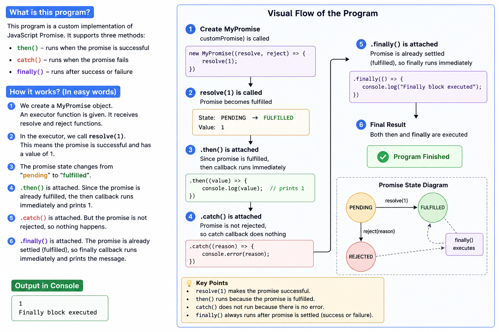

# MyPromise — Implementation Deep Dive

This document explains how the custom `MyPromise<T, K>` class works, maps each piece to native Promise behavior, and documents the bugs found and fixed.



---

## Type Design

```typescript
type TPromiseResolve<T> = (value?: T) => void;
type TPromiseReject<K>  = (reason?: K) => void;
```

Both `resolve` and `reject` accept their argument as **optional** (`value?`). This mirrors native Promise where `resolve()` and `reject()` can be called with no argument. The `?` expands the parameter type to `T | undefined`.

```typescript
type TPromiseExecutor<T, K> = (
  resolve: TPromiseResolve<T>,
  reject:  TPromiseReject<K>,
) => void;
```

The executor is a generic function receiving both settler callbacks. It returns `void` because its only job is to trigger settlement as a side effect — not return a value.

```typescript
type TPromiseThenCallback<T>    = (value: T | undefined) => void;
type TPromiseCatchCallback<K>   = (reason: K | undefined) => void;
type TPromiseFinallyCallback    = () => void;
```

`then`/`catch` callbacks accept `| undefined` to match the optional nature of their inputs. `finally` receives nothing — consistent with native `Promise.prototype.finally`.

---

## State Machine

```typescript
enum PromiseState {
  PENDING   = "pending",
  FULFILLED = "fulfilled",
  REJECTED  = "rejected",
}
```

```text
                resolve(value)
  PENDING ──────────────────────▶ FULFILLED
     │
     │ reject(reason)
     ▼
  REJECTED
```

The `_state` field enforces that once a promise settles, it cannot be re-settled. Both `_promiseResolver` and `_promiseRejecter` guard with:

```typescript
if (this._state !== PromiseState.PENDING) return;
```

This single guard covers both directions — a fulfilled promise ignores a subsequent `reject()`, and vice versa.

---

## Instance Fields

```typescript
private _state: PromiseState = PromiseState.PENDING;
private _successCallbackHandlers: TPromiseThenCallback<T>[] = [];
private _failureCallbackHandlers: TPromiseCatchCallback<K>[] = [];
private _finallyCallbackHandlers: TPromiseFinallyCallback | undefined = undefined;
private _value:  T | undefined = undefined;
private _reason: K | undefined = undefined;
```

| Field                      | Purpose                                                        |
| -------------------------- | -------------------------------------------------------------- |
| `_state`                   | Tracks current promise phase                                   |
| `_successCallbackHandlers` | Queue of `.then()` handlers registered before settlement       |
| `_failureCallbackHandlers` | Queue of `.catch()` handlers registered before settlement      |
| `_finallyCallbackHandlers` | Single `.finally()` handler (limitation — see issues below)    |
| `_value`                   | Stores resolved value so late `.then()` calls can replay it    |
| `_reason`                  | Stores rejection reason so late `.catch()` calls can replay it |

`_value` and `_reason` are critical. Because the executor runs **synchronously**, the promise may already be settled before any `.then()` / `.catch()` is chained. Storing the settled value allows the public API to call handlers immediately on late registration.

---

## Constructor & `this` Binding

```typescript
constructor(executor: TPromiseExecutor<T, K>) {
  executor(
    this._promiseResolver.bind(this),
    this._promiseRejecter.bind(this),
  );
}
```

### Why `.bind(this)` is mandatory

When you pass a class method as a plain function reference, JavaScript loses the implicit `this` context. Without `.bind(this)`:

```typescript
executor(this._promiseResolver, this._promiseRejecter);
//              ↑ passed as a bare function
//                when executor calls it: resolve(1)
//                `this` inside _promiseResolver is undefined (strict mode)
//                → TypeError: Cannot read properties of undefined
```

`.bind(this)` creates a new function permanently bound to the class instance, so `this._state`, `this._value`, etc., are always accessible when the executor invokes the settlers.

---

## `.then()` — Dual-path Registration

```typescript
public then(handlerFn: TPromiseThenCallback<T>) {
  if (this._state === PromiseState.FULFILLED && this._value !== undefined) {
    handlerFn(this._value);  // already settled → call immediately
  } else {
    this._successCallbackHandlers.push(handlerFn); // pending → queue for later
  }
  return this;
}
```

Two paths exist because the executor is synchronous:

**Path A — handler registered after settlement (most common in sync executors):**
```typescript
new MyPromise((resolve) => resolve(1))  ← settles here
  .then(v => console.log(v))            ← state is FULFILLED, calls immediately
```

**Path B — handler registered before settlement (async executors):**
```typescript
new MyPromise((resolve) => setTimeout(() => resolve(1), 1000))  ← still PENDING
  .then(v => console.log(v))  ← queued into _successCallbackHandlers
                               ← called 1 second later by _promiseResolver
```

---

## `.catch()` — Mirror of `.then()`

```typescript
public catch(handlerFn: TPromiseCatchCallback<K>) {
  if (this._state === PromiseState.REJECTED && this._reason !== undefined) {
    handlerFn(this._reason);
  } else {
    this._failureCallbackHandlers.push(handlerFn);
  }
  return this;
}
```

Exact same dual-path pattern but for the rejection branch. Only invoked when `_state === REJECTED`.

Note: in native Promise, `.catch(fn)` is literally `then(undefined, fn)` — errors in `.then()` propagate to the next `.catch()` in the chain. This implementation does **not** support that — `.catch()` only handles explicit `reject()` calls.

---

## `.finally()` — The Bug & The Fix

### Original (broken):
```typescript
public finally(handlerFn: TPromiseFinallyCallback) {
  if (this._state !== PromiseState.PENDING) {
    this._finallyCallbackHandlers = handlerFn; // ← stored but never called!
  }
  return this;
}
```

**Why it fails:** By the time `.finally()` is called in the chain, the executor has already run and `_promiseResolver` has already completed — including its `_finallyCallbackHandlers()` invocation. Storing the handler at this point is too late; nothing will trigger it again.

### Fixed:
```typescript
public finally(handlerFn: TPromiseFinallyCallback) {
  if (this._state !== PromiseState.PENDING) {
    handlerFn(); // already settled → call immediately
  } else {
    this._finallyCallbackHandlers = handlerFn; // pending → register for later
  }
  return this;
}
```

Same dual-path pattern as `.then()` and `.catch()`.

---

## `_promiseResolver` — Settlement Logic

```typescript
private _promiseResolver(value: T | undefined) {
  if (this._state !== PromiseState.PENDING) return;  // idempotency guard
  this._state = PromiseState.FULFILLED;
  this._value = value;                                // store for late .then() calls
  if (value !== undefined) {
    this._successCallbackHandlers.forEach((cb) => cb(value));
  }
  if (this._finallyCallbackHandlers) {
    this._finallyCallbackHandlers();
  }
}
```

Sequence:
1. Guard — bail if already settled
2. Transition state to `FULFILLED`
3. Persist `value` for late registrations
4. Drain the `.then()` handler queue
5. Fire `.finally()` if it was registered before settlement

The `value !== undefined` guard means handlers are skipped if `resolve()` is called with no argument. This is a known limitation — see issues below.

---

## `_promiseRejecter` — Mirror of Resolver

```typescript
private _promiseRejecter(reason: K | undefined) {
  if (this._state !== PromiseState.PENDING) return;
  this._state = PromiseState.REJECTED;
  this._reason = reason;
  if (reason !== undefined) {
    this._failureCallbackHandlers.forEach((cb) => cb(reason));
  }
  if (this._finallyCallbackHandlers) {
    this._finallyCallbackHandlers();
  }
}
```

Identical structure, operating on the rejection branch.

---

## Full Execution Trace

```typescript
const p1 = customPromise()       // executor runs: resolve(1)
  .then(v => console.log(v))     // state=FULFILLED, v=1 → logs 1 immediately
  .catch(e => console.error(e))  // state≠REJECTED → pushed to queue (never fires)
  .finally(() => console.log("Finally block executed"));
  // FIXED: state≠PENDING → calls handler immediately → logs "Finally block executed"
```

```
Timeline (synchronous, single frame):

[1] new MyPromise executor runs
      → _promiseResolver(1) called
      → _state = FULFILLED
      → _value = 1
      → _successCallbackHandlers is [] (then not called yet)
      → _finallyCallbackHandlers is undefined (finally not called yet)

[2] .then(cb) called
      → state is FULFILLED, value = 1
      → cb(1) called immediately → console.log(1) ✅

[3] .catch(cb) called
      → state is not REJECTED
      → pushed to _failureCallbackHandlers (sits idle forever)

[4] .finally(cb) called
      → state is not PENDING (it's FULFILLED)
      → cb() called immediately → console.log("Finally...") ✅
```

---

## Known Limitations vs Native Promise

| Behavior                        | Native Promise                           | MyPromise                                    |
| ------------------------------- | ---------------------------------------- | -------------------------------------------- |
| `.then()` returns new Promise   | ✅ enables independent chaining           | ❌ returns `this` — same instance             |
| Error propagation through chain | ✅ throw in `.then()` → next `.catch()`   | ❌ not implemented                            |
| Multiple `.finally()` handlers  | ✅ each call creates new Promise          | ❌ single slot — last one wins                |
| `resolve(undefined)` fires then | ✅ always fires handlers                  | ❌ skipped due to `value !== undefined` guard |
| Microtask scheduling            | ✅ callbacks are always async (microtask) | ❌ callbacks run synchronously                |
| `Promise.all` / `.race` / etc.  | ✅ built-in                               | ❌ not implemented                            |

The most architecturally significant gap is **returning `this` from `.then()`**. Native Promise returns a **new** Promise from each `.then()`, which means branches can be independent:

```typescript
const base = Promise.resolve(1);
const branch1 = base.then(v => v + 10);  // independent
const branch2 = base.then(v => v + 20);  // independent
```

With `return this`, both branches mutate the same promise — handlers accumulate and ordering becomes unpredictable.
